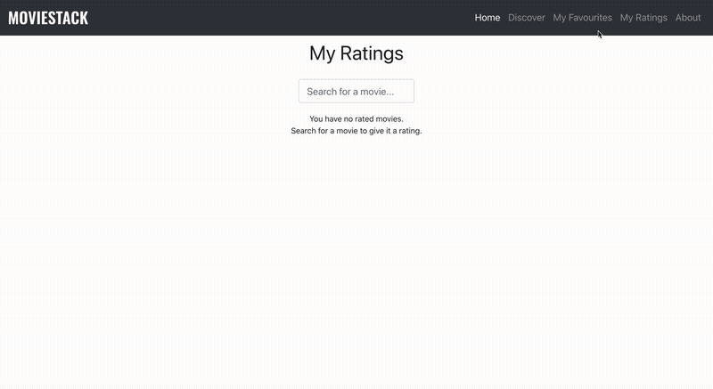

# MovieStack

A simple movie application created with the React framework. Movie data is obtained from The Movie Database API and local storage is used to save ratings and favorited movies.

## Home

  

## Discover

  

## Favorites

  

## Ratings

  

